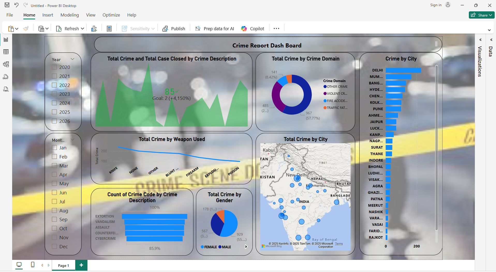

# Crime Report Dashboard - Power BI

## 📊 Project Overview
This Power BI dashboard provides a comprehensive analysis of crime data across multiple cities in India.

## 🔑 Key Insights
- Total Crime Trends (Year & Month Wise)
- Crime by City
- Crime by Domain (Violent, Traffic, Cyber, etc.)
- Crime by Weapon Used
- Crime Distribution by Gender
- Interactive Map Visualization

## 🛠 Tools Used
- Power BI
- DAX
- Power Query
- Data Cleaning & Visualization

## 📷 Dashboard Preview

## 📁 File
- `Crime_Report_Dashboard.pbix`

## 👤 Created By
Anubhav Pandey  
Aspiring Data Analyst
